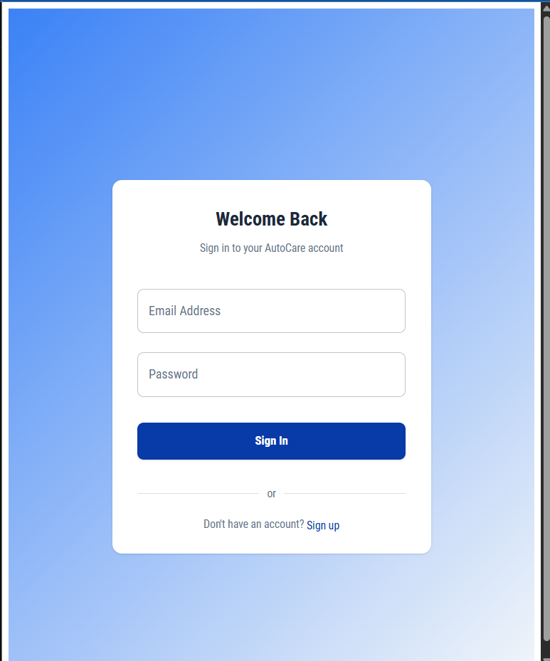
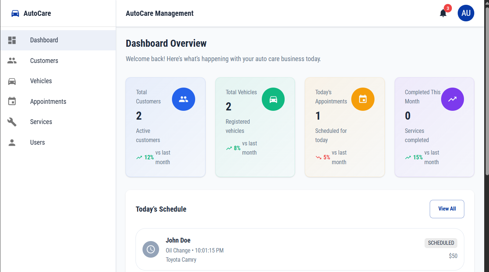

# AutoCare Web UI Sample

A modern React TypeScript application for managing vehicle repair appointments and procedures. Built as a showcase project demonstrating frontend features.

## 💬 Join Our Community on Discord

Have questions, feedback, or want to contribute? Join our [Discord server](https://discord.gg/mcP7eAEhMX) to connect with other developers, get support, and stay updated on the latest news!

## 🚀 Features

- **Dashboard**: Overview of customers, vehicles, and appointments
- **Customer Management**: Add, edit, and manage customer information
- **Vehicle Management**: Track customer vehicles and their details
- **Appointment Scheduling**: Schedule and manage repair appointments

## 🛠️ Tech Stack

- **Frontend Framework**: React 18 + TypeScript
- **Build Tool**: ViteJS
- **UI Library**: Material-UI (MUI)
- **State Management**: Redux Toolkit
- **API Layer**: RTK Query
- **Form Handling**: React Hook Form + Zod validation
- **Routing**: React Router v6
- **Mocking**: MSW (Mock Service Worker)
- **Code Quality**: ESLint + Prettier

## 📦 Installation

1. [Clone](https://docs.github.com/en/repositories/creating-and-managing-repositories/cloning-a-repository#cloning-a-repository) the repository.


2. Install dependencies:
```bash
npm install
```

3. Start the app :
```bash
npm run dev
```

4. Open your browser and navigate to \`http://localhost:3000\`. You should see the application running like this :



Use the following credentials to log in:
- **Email**: `admin@autocare.com`
- **Password**: `password`

Once logged in, you will see the dashboard :



## Project Structure (TODO)

## Scripts

- `npm run dev` - Start development server
- `npm run build` - Build for production
- `npm run preview` - Preview production build
- `npm run lint` - Run ESLint
- `npm run lint:fix` - Fix ESLint issues
- `npm run format` - Format code with Prettier
- `npm run format:check` - Check code formatting
- `npm run type-check` - Run TypeScript type checking

## 🎯 Key Features Implementation

### Form Handling
- React Hook Form for performant form handling
- Zod schema validation for type-safe form validation
- Material-UI integration for consistent styling

### API Integration
- RTK Query for efficient API data fetching and caching.
- Mock Service Worker for development and testing
- Proper error handling and loading states

### Type Safety
- Strict TypeScript configuration
- Comprehensive type definitions for all components and API responses
- Type-safe API calls and state management with Redux Toolkit.

## 🔄 API Endpoints

Currently, the application uses a mock API. The endpoints were created quickly to demonstrate the frontend features.

The real backend API is not yet implemented as it requires work on [OpenAPI](https://www.openapis.org/) specification. The frontend is designed to work seamlessly with the backend once it is ready.

### Development with MSW

The application uses [Mock Service Worker (MSW)](https://mswjs.io/) to mock API responses during development. This allows for:

- Independent frontend development
- Consistent testing environment
- Realistic API simulation

Mock data is defined in `./src/mocks/handlers.ts` and automatically starts in development mode.

## 🎨 UI/UX Design

- Clean, modern interface using [Material-UI](https://mui.com/material-ui/) components
- Responsive design that works on all screen sizes
- Consistent color scheme and typography
- Intuitive navigation with sidebar layout
- Loading states and error handling
- Form validation with helpful error messages

## 🤝 Contributing (TODO)

## 🚀 Deployment

To build for production:

```bash
npm run build
```

The built files will be in the \`dist\` directory, ready for deployment to any static hosting service.

## 📄 License

This project is open source and available under the [MIT License](LICENSE).
